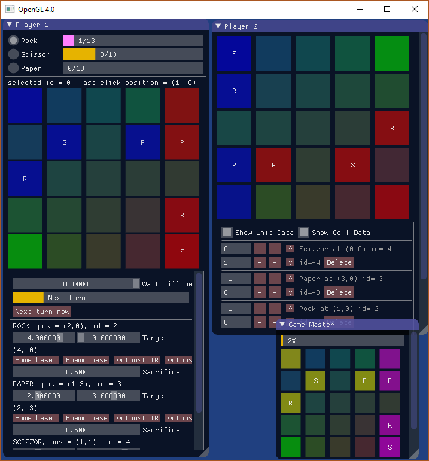
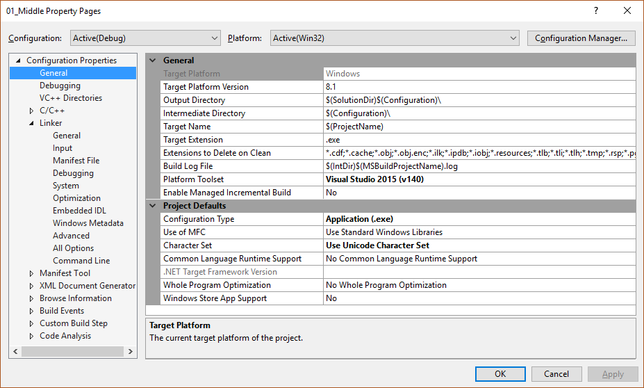
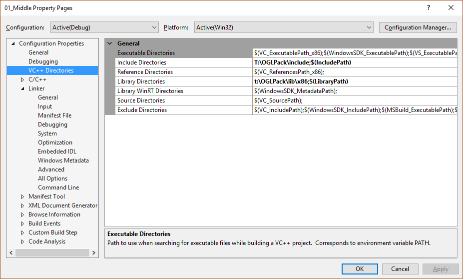
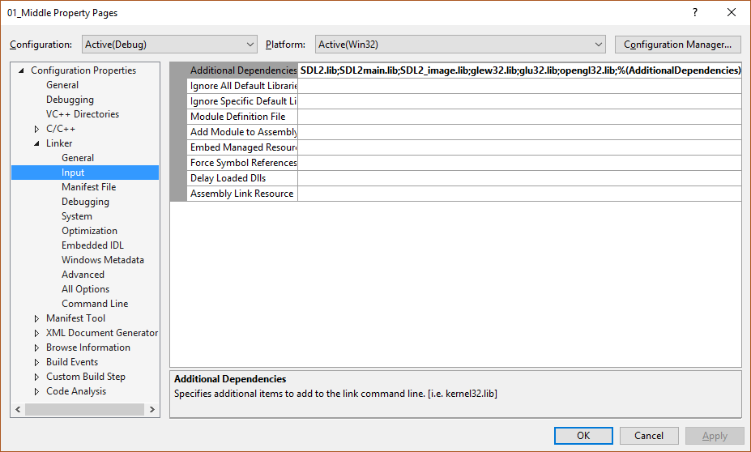
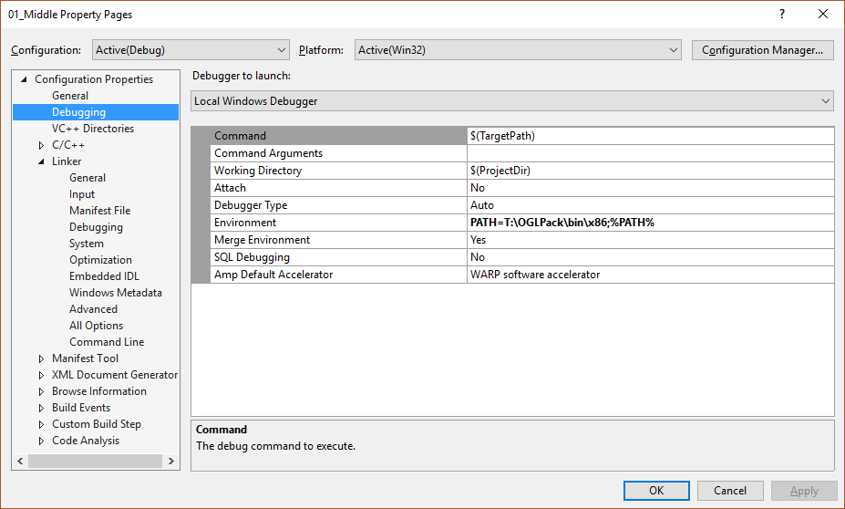

# Install Guide
---
## 0. Requirements
* Windows **7**, 8, or **10**
* Microsoft Visual Studio 2013, **2015**, or 2017 (with C++)
* OpenGL 3.0 compatible GPU (almost any, including integrated)
* [**OpenGL Pack**](http://people.inf.elte.hu/csabix/ru/OGLPack.zip)
* [Optional] Read the [Project Report](http://people.inf.elte.hu/csabix/publications/natural-computing-project.pdf).

## 1. Download files

* Download Visual Studio, the free version is more than enough. We used with 2015.
* Download the project, and the OpenGL pack as well, then unzip.
* Open a command prompt and type `subst t: <path to OGLPack>`, for example `subst t: c:\`.
    This creates a virtual drive that "points to" the folder containing the pack. This way, the setup is much easier. The drive will cease to exist the next time you restart.
* Go to the new drive `T:\`. There supposed to be an `OGLPack` folder. Inside this folder, there should be three folders: `bin`, `include`, and `lib`

## 2. Compile
* Start Visual Studio and open the `StrategyGame.sln` solution.
* At this point, the project should compile in both Release and Debug mode, and run without a problem. (F5)
* If it does not, go to section 4.

## 3. Use program
* The program starts training the network after starting it. The two sliders allow you to control the speed of the training, if you slow it down enough, you can see the game progressing, and the decisions that were made
* If you want to play against the computer, you have to recompile the project after editing `main.cpp`.
    - Between the marked lines, one can add games or other tasks to `gametasks` variable by calling the respective functions
    - These are explained in detail in the [Project Report](http://people.inf.elte.hu/csabix/publications/natural-computing-project.pdf)
    - For example, adding the following line creates a real-time strategy game like experience.
        ```C++
            gametasks.AddCyborgVsHeuristics(5);
        ```



## 4. Advanced install
If you ran into problems while installing, for example, you already have a `T:` drive in your PC, then you have to look through the visual studio solution properties.

## 4.0 Error types

First things first, there can be three kinds of error when trying to build and run:
* **Compilation error**, for example, the compiler cannot find the include directories.
* **Link error**, for example, the linker cannot find the libraries in OpenGL pack.
* **Runtime Error**, for example, the operating system cannot find the DLL-s.

If you encounter any of these, go to the appropriate sub-section, and double-check every property there is. If you already had a `T:` drive, then you have to replace every occurrence of `T:\` to the location where you downloaded the OGLPack.

In Visual Studio, go to Solution Explorer tab, right-click on 01_Middle, and go to properties; or click on 01_Middle properties in the Project menu; or simply press `Alt+F7`. Any of this brings up the 01_Middle Property Pages window.

### 4.1 Compilation error

Edit the properties as follow.





### 4.2 Link Error
 
Make sure that path to  "Libary Directories" is set, see image above.



### 4.3 Runtime Error
The Environment variables have to be set

